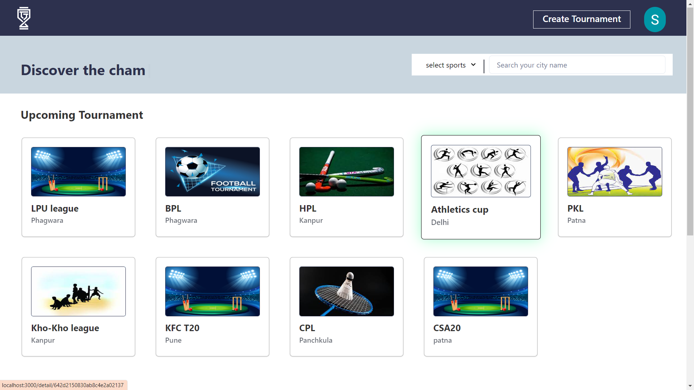

# TournaTrack App

Track

TournaTrack is a MERN stack web application developed by Shubham kumar. It is a platform where users can easily create organise and participate in various sports tournaments. Now you can easily create and manage the tournaments from anywhere. TournaTrack provides a convenient and user-friendly experience.

# Live Demo

Check out the live version of : [TournaTrack App Live Demo](https://tournatrack.netlify.app/)

# Features

- Browse and search for a wide range of tournaments and you can filter it by sports at the same time.
- You can create tournaments by just filling some basic details.
- You can easily participates in any of the tournaments as well.
- You can see that how many tournaments I have create and how many teams have participated in that as well with their details.
- You can sechdule the matches as well for now it is in developing phase.
- User-friendly interface and smooth navigation.
- You can get the premium features as well by paying some minimum amount through any payment method via Razorpay.
- If you forgot you accounts you can easily reset your password by providing emails that will send a rest link.

# Technologies Used

- TournaTrack is built using the following technologies:
- MongoDB: A NoSQL database used to store product and user information
- Express: A web application framework for Node.js used to build the backend server
- React: A JavaScript library used for building the user interface
- Node.js: A JavaScript runtime used for server-side development
- HTML: The standard markup language for creating web pages
- CSS: A stylesheet language used for designing the application's appearance
- Chakra ui: A CSS library used for better user interface
- JavaScript: The programming language used for client-side and server-side scripting

# Installation

To run TournaTrack locally on your machine, follow these steps:

1. Clone the repository: git clone https://github.com/ImShubhK/TournaTrack.git
2. Navigate to the project directory: cd TournaTrack
3. Install the dependencies: npm install
4. Start the development server: npm start
5. Open your browser and visit: http://localhost:3000

# Contributing

Contributions are welcome! If you find any bugs or have suggestions for improvements, please feel free to open an issue or submit a pull request.

# License

This project is licensed under the MIT License.

# Contact

If you have any questions or want to connect with the project developer, you can reach out to Shubham Kumar shu875758kumar@gmail.com

Thank you for your interest in TournaTrack! We hope you enjoy using the app.
